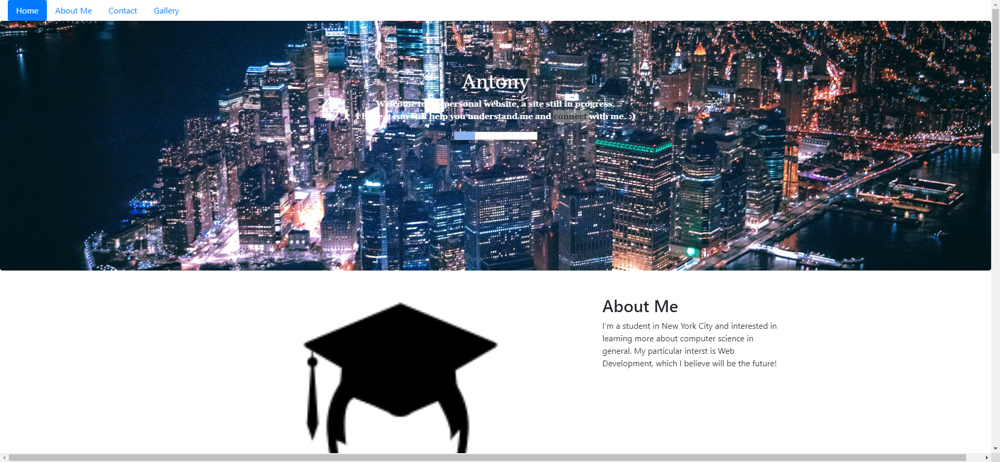
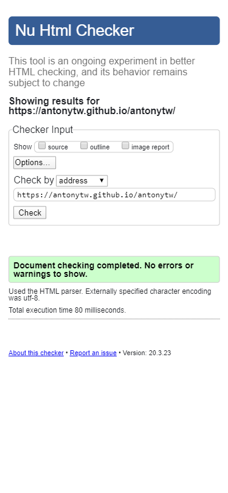
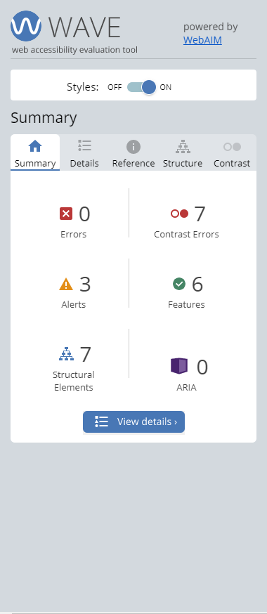

# antonytw
Personal Website

## I have built a personal website, using what I've learned. 
- Try to hover over the title and see the CSS effect. 
- Try to click the social media logos and see the JS pop-ups.

## The site is responsive with primarily two views, mobile and desktop. 

## Most importantly, this site is validated and accessible!

